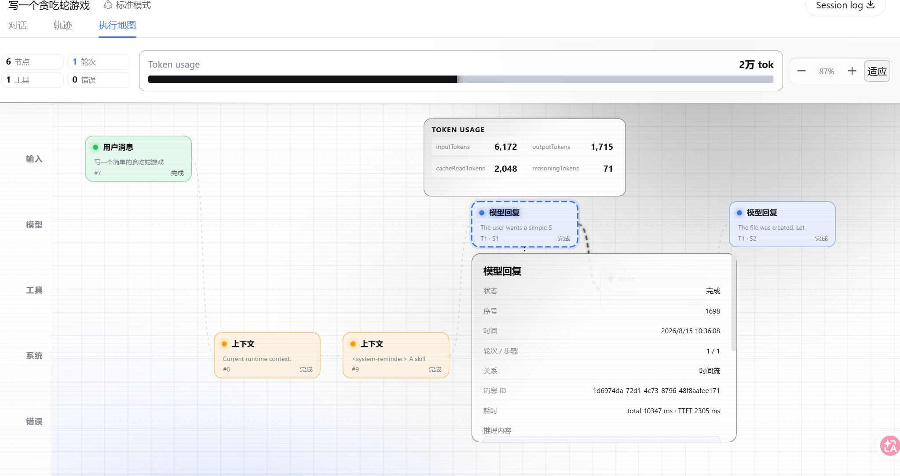

# DSH TraceLens

[English](README.md) | 中文

**看见每一步智能体执行，理解每一次 Token 消耗。**

DSH TraceLens 是基于 [DeepSeek Harness](https://github.com/deepseek-ai/deepseek-harness) 的可视化执行探索器。它把当前已加载的 Session 转换成交互式地图，集中呈现用户输入、模型回复、工具调用、系统活动、错误以及每次模型调用的 Token 用量，同时不引入第二套事件存储，也不修改 agent loop（智能体循环）。

TraceLens 面向需要理解智能体为何产生某种行为的开发者。你可以在同一张可导航画布上跟随持续展开的执行路径、比较每次模型调用的 Token 成本，并检查任意节点背后的准确上下文。



## 项目概览

**执行地图**位于现有会话视图旁边，并随着 Session 执行实时更新。五条固定泳道分别承载输入、模型、工具、系统和错误记录。选择任意节点即可检查该事件已经记录的数据，包括消息内容、模型请求详情、推理内容、工具参数与结果、耗时、错误、重试，以及存在时的嵌套调用。

页面通过覆盖整个会话的 100% 堆叠仪表盘汇总模型用量。选择模型节点会高亮对应分段，并打开包含输入、输出、缓存读取和推理用量的四指标 Token 卡。模型工具请求与结果只在拥有相同 `callId` 时建立明确关系；普通相邻记录只表达时间顺序。

## 核心特性

- **实时执行地图**：新的 Session 记录到达时，不会替换当前缩放、拖动位置或节点选择。
- **Token 归因**：对比每次模型调用占当前已加载会话总量的比例，并查看准确记录值。
- **深度节点检查**：在所选节点正下方打开分类详情，不用右侧面板挤占画布宽度。
- **大型工作流可读性**：适应模式从 100% 开始，最低缩放到 30%，并支持手动缩放与双轴同步拖动。
- **确定性投影**：浏览器只渲染公开会话快照，不根据文本、时间或距离推断依赖关系。
- **原生 DSH 集成**：client 插件通过正式 `conversation.view` slot（插槽）贡献视图，并遵循宿主主题、本地化、资源释放和 reduced-motion（减少动态效果）行为。

<a id="run"></a><a id="run-from-source"></a>

## 快速开始

前置条件：Node.js `^22.19` 或 `>=24`、pnpm，以及用于真实模型执行的 DeepSeek API key（密钥）。

```sh
git clone https://github.com/BLueMooneer/dsh-tracelens.git
cd dsh-tracelens
pnpm install
pnpm run build
pnpm dsh web
```

打开 `http://127.0.0.1:3080`，创建或进入一个 Session，然后选择**执行地图**。用于 Web 组合测试的免密钥 fixture（固定测试数据）Session 也可以渲染该地图。

操作与故障排查见[执行地图使用指南](docs/user/guide/agent-map.md)。实现细节与扩展规则见[插件 README](packages/client/ui-agent-map/README.md)。

## 架构

DSH TraceLens 保持在 DeepSeek Harness 的插件架构内：

```text
Session projection
      ↓
pure graph projection
      ↓
Agent Map client plugin
      ↓
conversation.view slot
      ↓
DSH Web UI
```

图模型与布局由纯函数负责。React 只拥有选择、适应／手动比例和视口位置等实时视图状态。插件不增加 host service（宿主服务）、持久化格式、模型可见输入或第二套会话投影。

主要实现位于 [`packages/client/ui-agent-map`](packages/client/ui-agent-map)。Web profile（运行配置）的组合声明位于 [`packages/bundle/web-app`](packages/bundle/web-app)。

## 开发

在仓库根目录运行执行地图的针对性检查：

```sh
pnpm exec tsc -p packages/client/ui-agent-map/tsconfig.json --noEmit
pnpm exec vitest run packages/client/ui-agent-map/tests
pnpm --filter @deepseek-ai/dsh-client-ui-agent-map bundle
pnpm run build:web
```

涉及仓库级文档或集成的改动还必须通过 [AGENTS.md](AGENTS.md) 指定的 DeepSeek Harness 对应检查。

## 项目状态

DSH TraceLens 跟随仍处于开发者预览阶段的 DeepSeek Harness，后者可能引入破坏兼容性的变更。当前项目是集成到 Web profile 的 fork（派生仓库），而不是独立发版的 npm 插件。

## 上游与许可证

本项目基于 [DeepSeek Harness](https://github.com/deepseek-ai/deepseek-harness) 与 [Cordis](https://github.com/cordiverse/cordis)。上游社区与贡献说明仍以 DeepSeek Harness 仓库为准。

[MIT](LICENSE)。第三方依赖及其许可证见 [THIRD_PARTY_NOTICES.md](THIRD_PARTY_NOTICES.md)。
